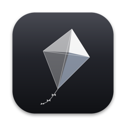
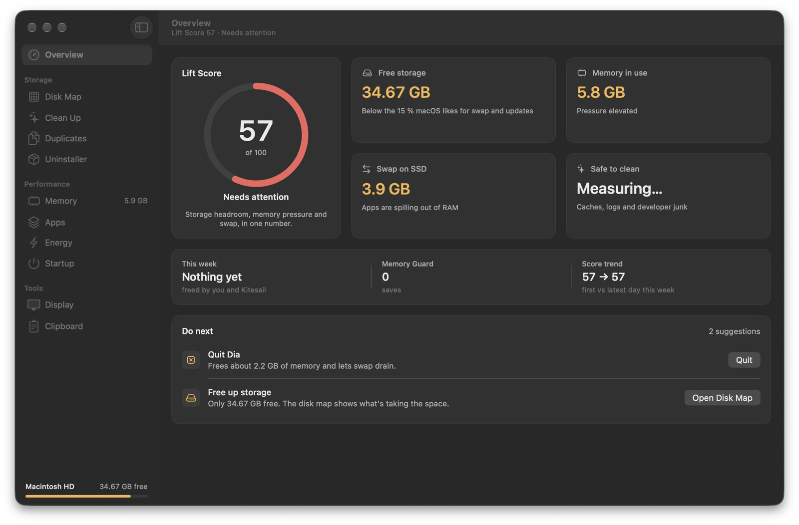
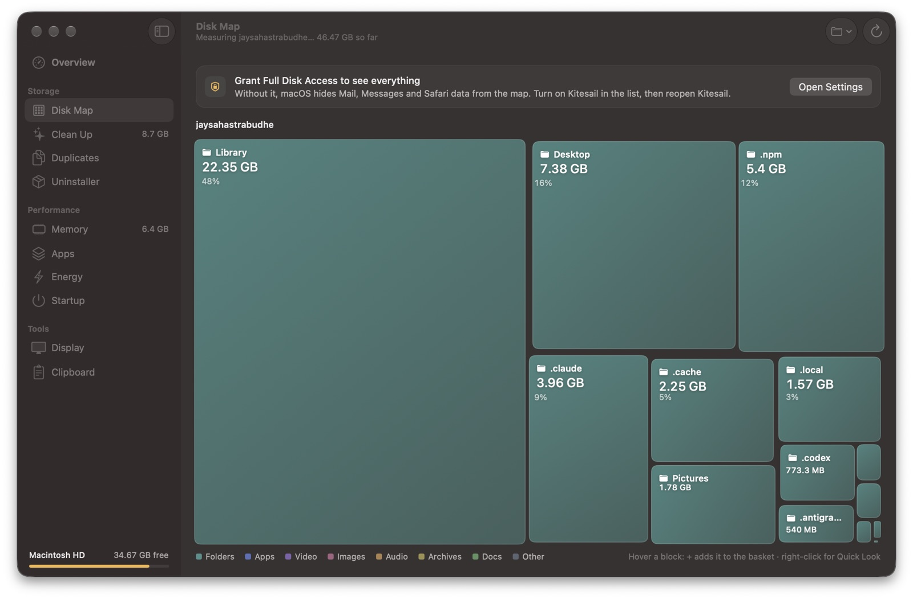
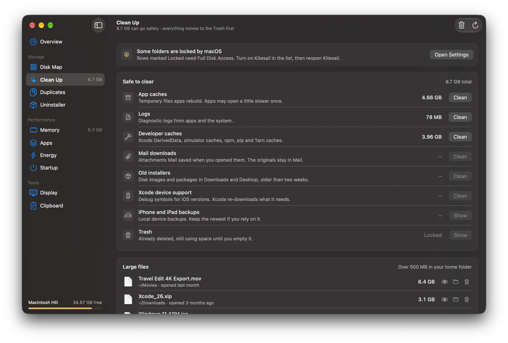
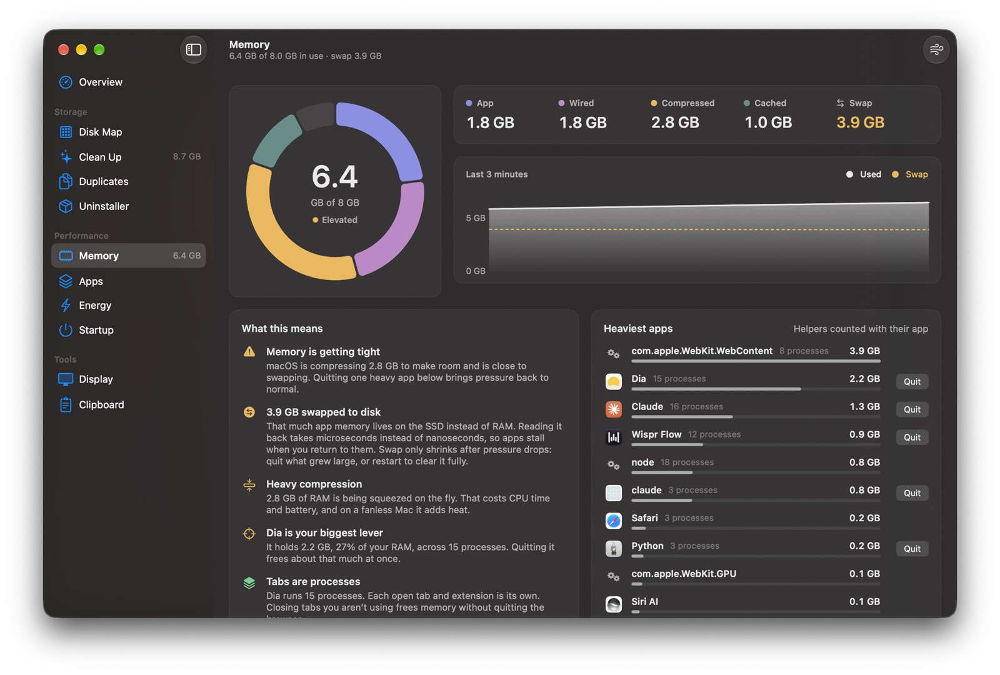
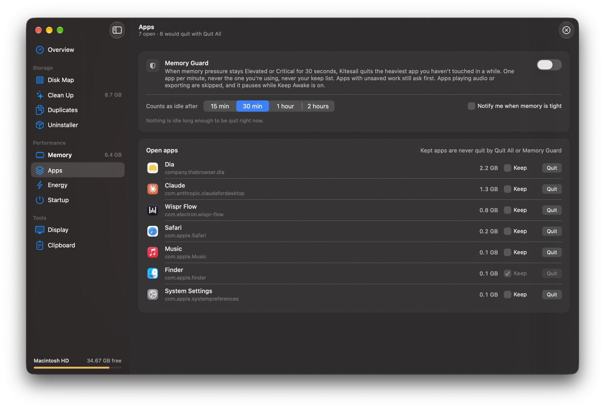
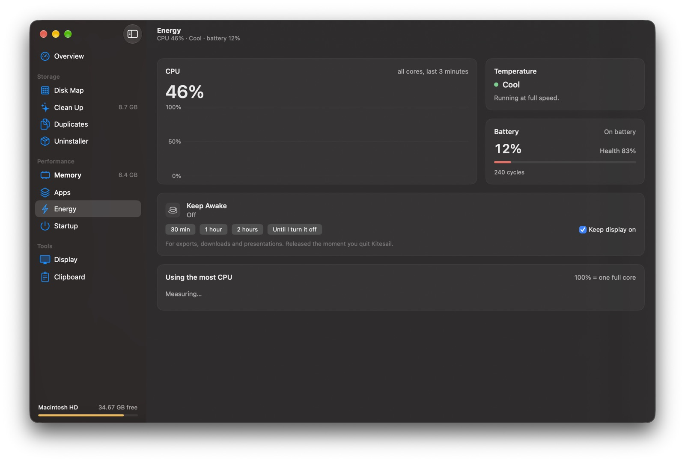
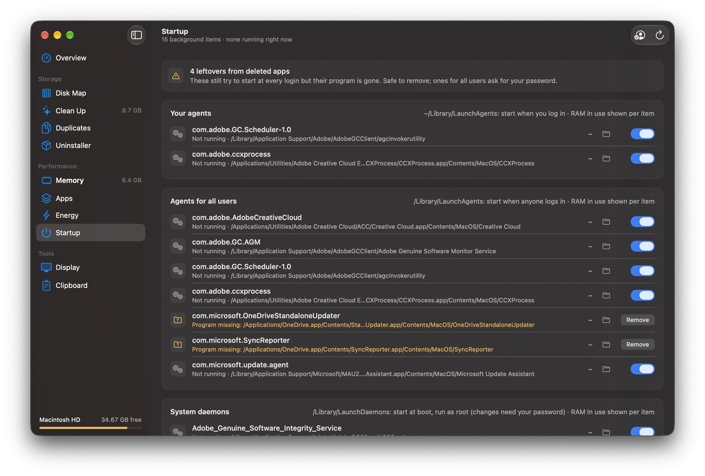
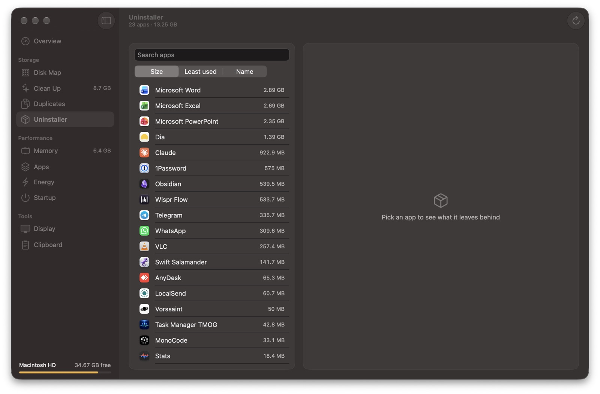
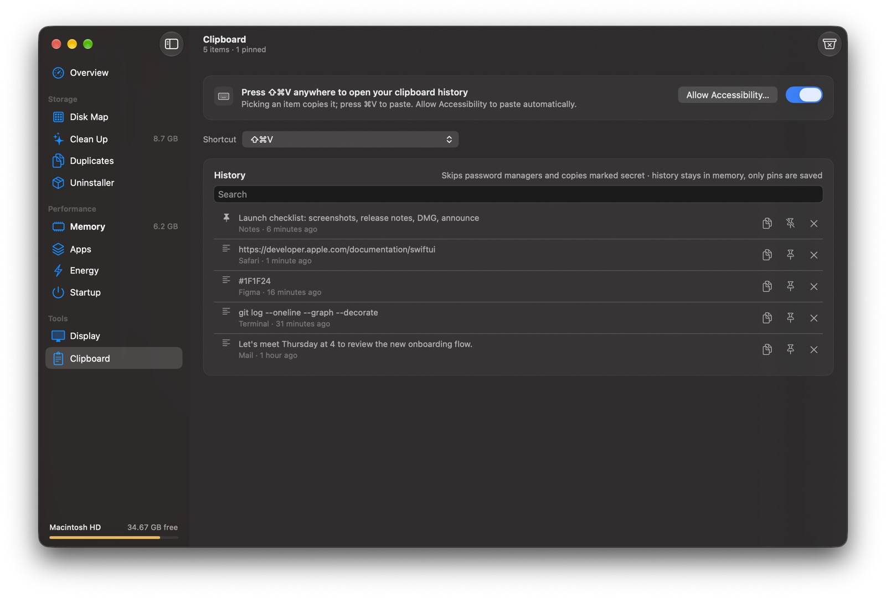

<p align="center">
  
</p>

<h1 align="center">Kitesail</h1>

<p align="center">
  <b>Keep your Mac light.</b> Storage, memory and displays in one small, native app.<br>
  Free and open source · macOS 26+ · Apple Silicon
</p>

<p align="center">
  <a href="https://github.com/jaysahastrabudhe/kitesail/releases/latest/download/Kitesail.dmg"><b>Download Kitesail.dmg</b></a> ·
  <a href="https://buymeacoffee.com/LCIJOxlNF">☕ Support development</a>
</p>

<p align="center">
  
</p>

---

## Why Kitesail

Most "Mac cleaner" apps are heavy, nag you, and hide what they actually do. Kitesail is the opposite:

- **Light.** It's a native SwiftUI app that uses about 60–100 MB of RAM in normal use and no CPU at idle. It samples memory with a cheap kernel read and does its scanning at background priority, so it's gentle even on a fanless 8 GB MacBook Air.
- **Honest.** It tells you *when* quitting apps will help and when it won't ("unused RAM is wasted RAM"), in plain English.
- **Safe.** Everything it deletes goes to the Trash first. Display changes revert on their own unless you press **Keep**. Photos, Final Cut and virtual machine libraries are never touched.
- **Private.** Kitesail never connects to the internet: no accounts, no analytics, no telemetry.

## Features

### Overview
- **Lift Score**: one number (0–100) for how comfortable your Mac is right now. It combines free storage, memory pressure and swap.
- **Do next**: suggestions tied to your situation, like "Quit Dia, frees 2.2 GB" or "Clear caches, 8.7 GB", each with a one-click action.
- **Weekly recap**: space freed, Memory Guard saves and your score trend.

### Storage
| | |
|---|---|
| **Disk Map** | An animated treemap of any folder. Click to drill in, Quick Look anything, delete with a brick-shatter animation, or collect blocks in a **delete basket** and remove them in one go. |
| **Clean Up** | App caches, logs, developer caches (Xcode DerivedData, simulators, npm, pip, Yarn), Mail downloads, old installers, Xcode device support, plus a Spotlight-powered **large files** list. |
| **Duplicates** | Exact duplicates over 1 MB, found by size → first 64 KB → full SHA-256. Skips APFS clones and hard links, since deleting those frees nothing. "Keep newest" per set. |
| **Uninstaller** | Removes an app *and* its leftovers (Application Support, Caches, Preferences, Containers, saved state, launch agents). Near-matches that could belong to a sibling app start unchecked. |

<p align="center"> </p>

### Performance
| | |
|---|---|
| **Memory** | App / wired / compressed / cached breakdown, pressure, swap, a 3-minute history, and **heaviest apps with helper processes counted under their app** (all of Chrome's renderers count as "Chrome"). Explains what the numbers mean. |
| **Memory Guard** | Opt-in. When pressure stays *Elevated* or *Critical*, it quits the heaviest app you haven't touched in a while: one app per minute, never the one you're using, never your keep list, never an app playing audio or exporting. It pauses while Keep Awake is on. |
| **Quit All** | Quit every app except your keep list, from the app, the menu bar or ⌘K. |
| **Leak watch** | Flags apps whose memory keeps climbing for 30+ minutes. |
| **Energy** | CPU per app, heat throttling on fanless Macs, battery health and cycle count, and **Keep Awake** (Amphetamine-style). |
| **Startup** | Third-party launch agents and daemons with their RAM use, on/off switches, and **leftovers from apps you already deleted**. |

<p align="center"> </p>
<p align="center"> </p>

### Tools
| | |
|---|---|
| **Display** | Resolution and refresh rate, plus **HiDPI Booster** for sharp, Retina-style text on 1080p and 1440p monitors (renders at 2× and scales down). For external monitors: **brightness, contrast, volume and input** over DDC. |
| **Clipboard history** | Press ⇧⌘V (or ⌥⌘V) anywhere. Search, pin, and paste straight into the app you were using. Skips password managers and copies marked secret, keeps history in memory, and saves only pins. |
| **Command palette** | ⌘K for everything: "quit dia", "keep awake 1 hour", "clean caches", "find duplicates"… |
| **Menu bar** | Memory at a glance, top apps, Keep Awake, clipboard, Quit All. |

<p align="center"> </p>

## Install

**Option 1: one line in Terminal (easiest)**

```bash
curl -fsSL https://raw.githubusercontent.com/jaysahastrabudhe/kitesail/main/install.sh | sh
```

This downloads the latest release, installs it to Applications and opens it. Files fetched this way aren't quarantined, so there's no "unidentified developer" prompt. You can [read the script](install.sh) first; it's short.

**Option 2: the disk image**

1. Download **Kitesail.dmg** from [Releases](https://github.com/jaysahastrabudhe/kitesail/releases/latest), open it, and drag Kitesail onto the Applications folder.
2. The first time, **right-click Kitesail → Open**. If macOS still refuses, go to *System Settings → Privacy & Security* and click **Open Anyway**. This is needed because Kitesail is signed ad hoc rather than notarized with a paid Apple Developer ID.

   Or in Terminal:
   ```bash
   xattr -dr com.apple.quarantine /Applications/Kitesail.app
   ```

Requires **macOS 26 (Tahoe) or later** on **Apple Silicon**. After an update, macOS may ask you to allow Full Disk Access and Accessibility again.

## Permissions

On first launch, Kitesail shows a single setup sheet so permissions don't pop up one at a time. All of them are optional:

| Permission | Used for | Without it |
|---|---|---|
| **Full Disk Access** | Seeing Mail, Messages, Safari data and the Trash in Disk Map and Clean Up | Those folders show as *Locked* |
| **Accessibility** | Pasting straight from clipboard history | Picking an item copies it; you press ⌘V |
| **Notifications** | Memory alerts, Memory Guard notices, weekly recap | No notifications |

A few actions (flushing the file cache, changing system startup items, some uninstalls) ask for your Mac password each time. That's macOS protecting system files.

> **Full Disk Access tip:** macOS doesn't list apps there until you add them. Click **+** (or drag Kitesail in), switch it on, then reopen Kitesail.

## Build from source

No Xcode needed; Command Line Tools are enough.

```bash
git clone https://github.com/jaysahastrabudhe/kitesail.git
cd kitesail
./build.sh              # → build/Kitesail.app
./make-dmg.sh           # → styled drag-to-Applications build/Kitesail-<version>.dmg
build/Kitesail.app/Contents/MacOS/Kitesail --selftest
```

`--selftest` checks the pure logic: treemap geometry, memory diagnosis, leak detection, the duplicate finder, DDC packets, command palette search and more.

## Notes

- HiDPI Booster uses the private `CGVirtualDisplay` API, and DDC uses the private `IOAVService` API, the same routes BetterDisplay and MonitorControl take. Apple could change them in a future macOS.
- External monitor control depends on your monitor and cable passing DDC commands; some docks and adapters don't.
- Inspired by the best of the Mac utility world: DaisyDisk, CleanMyMac, iStat Menus, Stats, BetterDisplay, MonitorControl, Maccy, Paste, QuitAll and Amphetamine.

## Support

Kitesail is free, with no features locked. If it keeps your Mac light and you'd like to support development:

**☕ [buymeacoffee.com/LCIJOxlNF](https://buymeacoffee.com/LCIJOxlNF)**

## License

[MIT](LICENSE) © 2026 Jay Sahastrabudhe
